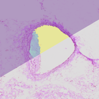

# Vesseg - speed up your atheroslerosis research

This is the beginning of the UI update of [vesseg](https://github.com/jacobmatthewmurray/vesseg). I developed it as an student research assistant at [IKIM](https://mml.ikim.nrw/) (Institute of artifical intelligence in medicine).

### 1. Clone the repository

`git clone https://github.com/whatisarthurdoing/Vesseg.git`
### 2. Create a virtual environment

In the project directory:
`python3 -m venv [name of environment]`
### 3. Activate virtual environment

`source [name of environment]/bin/activate`
### 4. Install the requirements

`pip install -r requirements.txt`
### 3. Run FastApi

`cd app`
`uvicorn backend.main:app --reload`

### 4. Run React

In new terminal: 

`cd app/frontend`
`npm install`
`npm start`

---
### Good to know

- Interactive API Documentation:
http://127.0.0.1:8000/docs

- Alternative interactive API Documentation:
http://127.0.0.1:8000/redoc

-  Material UI User Guide: https://mui.com/material-ui/getting-started/installation/

---
#### ! Important note
>This project is not finished yet. Please read the documentation carefully to understand which parts are finished and which need to be developed next.